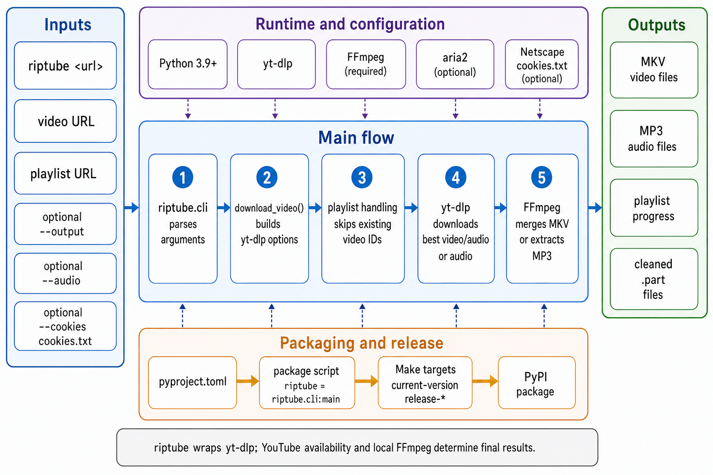

<div align="center">
  

  **📺 Download YouTube videos, playlists, and MP3 audio from one small CLI 🎵**
</div>

riptube is a Python command-line tool for downloading YouTube videos and playlists with yt-dlp. It picks the best available media by default, supports cookies for restricted videos, and can extract audio as MP3.

Use it when you want a direct `riptube <url>` workflow without managing yt-dlp options each time.

## Install

```bash
pipx install riptube
```

Then run:

```bash
riptube "https://www.youtube.com/watch?v=dQw4w9WgXcQ"
```

For local development from the repo root:

```bash
uv tool install . --editable
python -m riptube.cli "https://www.youtube.com/watch?v=dQw4w9WgXcQ"
```

## Commands

```bash
riptube <url>                         # download a video or playlist
riptube <url> -o "video.mp4"          # set an output path or yt-dlp template
riptube <url> -a                      # extract audio as MP3
riptube <url> -c cookies.txt          # use Netscape-format cookies
python -m riptube.cli <url>           # run directly during development
make current-version                  # print the package version
make release-patch                    # bump patch, lock, commit, and push
make release-minor                    # bump minor, lock, commit, and push
make release-major                    # bump major, lock, commit, and push
```

## Notes

- FFmpeg is required for video/audio merging and MP3 extraction.
- Python 3.9+ is recommended. Python 3.8 is still allowed by package metadata but prints a deprecation warning.
- Playlist downloads skip files whose local names already include the matching YouTube video ID.
- Playlist runs print an overall progress bar in addition to yt-dlp's current-file output.
- `-o` accepts either a single output path or a yt-dlp output template. Multi-item downloads need a template so entries do not overwrite each other.
- Cookie files must use Netscape `cookies.txt` format.

## Architecture



## License

[MIT](LICENSE)
